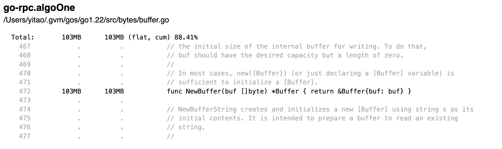

### Source Code for the great talk [Practical Memory Profiling](https://www.youtube.com/watch?v=6qAfkJGWsns) from Bill Kennedy

# Benchmark

```sh
# "-gcflags -m=2" show escape analysis result
$ go test -bench . -benchmem --memprofile p.out -gcflags -m=2
```

```sh
# Run profiler in command prompt
$ go tool pprof p.out
File: go-rpc.test
Type: alloc_space
Time: Nov 9, 2024 at 3:08pm (CST)
Entering interactive mode (type "help" for commands, "o" for options)
(pprof) list algoOne
Total: 116.50MB
ROUTINE ======================== go-rpc.algoOne in /Users/yitao/go-rpc/main.go
   13.50MB   116.50MB (flat, cum)   100% of Total
         .          .     64:func algoOne(data []byte, find []byte, repl []byte, output *bytes.Buffer) {
         .          .     65:   // use a bytes buffer to provide a stream to process
         .      103MB     66:   input := bytes.NewBuffer(data)
         .          .     67:
         .          .     68:   // the number of bytes we are looking for
         .          .     69:   size := len(find)
         .          .     70:
         .          .     71:   // declare the buffers we need to process the stream.
   13.50MB    13.50MB     72:   buf := make([]byte, size)
         .          .     73:   end := size - 1
         .          .     74:
         .          .     75:   // Read in an initial number of bytes we need to get started
         .          .     76:   if n, err := io.ReadFull(input, buf[:end]); err != nil {
         .          .     77:           output.Write(buf[:n])
(pprof)

```

There are two columns: `flat`, `cum` (accumulative)

- `flat`: allocation happening because of code inside the functions being called here
- `cum`: allocation happening down the call path

line `main.go:66` does not have flat allocation, means allocation happens only down the call path

Now let's see the result from the web

```sh
# Run profiler in browser
$ go tool pprof -http=:6060 p.out
```



web version is different from the console version that web version showing that allocation is flat (only happens at bytes.NewBuffer func call), whereas console version showing that allocation is accumlative (down the call path).

Let's see why by showing escape analysis result.

```sh
$ go tool pprof p.out
File: go-rpc.test
Type: alloc_space
Time: Nov 9, 2024 at 3:08pm (CST)
Entering interactive mode (type "help" for commands, "o" for options)
(pprof) o
  call_tree                 = false
  compact_labels            = true
  divide_by                 = 1
  drop_negative             = false
  edgefraction              = 0.001
  focus                     = ""
  granularity               = functions            //: [addresses | filefunctions | files | functions | lines]
  hide                      = ""
  ignore                    = ""
  intel_syntax              = false
  mean                      = false
  nodecount                 = -1                   //: default
  nodefraction              = 0.005
  noinlines                 = false
  normalize                 = false
  output                    = ""
  prune_from                = ""
  relative_percentages      = false
  sample_index              = inuse_space          //: [alloc_objects | alloc_space | inuse_objects | inuse_space]
  show                      = ""
  show_from                 = ""
  sort                      = flat                 //: [cum | flat]
  tagfocus                  = ""
  taghide                   = ""
  tagignore                 = ""
  tagleaf                   = ""
  tagroot                   = ""
  tagshow                   = ""
  trim                      = true
  trim_path                 = ""
  unit                      = minimum
(pprof)
```

we can see `noinlines                 = false` in console version.

However, in web version, `noinlines = true`.

> Inlining optimization: no calling the function, instead copy the function content over here inline.

Let's change it to true, and `list algoOne` again:

```sh
(pprof) noinlines = true
(pprof) list algoOne
Total: 116.50MB
ROUTINE ======================== go-rpc.algoOne in /Users/yitao/go-rpc/main.go
  116.50MB   116.50MB (flat, cum)   100% of Total
         .          .     64:func algoOne(data []byte, find []byte, repl []byte, output *bytes.Buffer) {
         .          .     65:   // use a bytes buffer to provide a stream to process
     103MB      103MB     66:   input := bytes.NewBuffer(data)
         .          .     67:
         .          .     68:   // the number of bytes we are looking for
         .          .     69:   size := len(find)
         .          .     70:
         .          .     71:   // declare the buffers we need to process the stream.
   13.50MB    13.50MB     72:   buf := make([]byte, size)
         .          .     73:   end := size - 1
         .          .     74:
         .          .     75:   // Read in an initial number of bytes we need to get started
         .          .     76:   if n, err := io.ReadFull(input, buf[:end]); err != nil {
         .          .     77:           output.Write(buf[:n])
(pprof)
```

Now we can see there is a flat allocation in console version.

`buffer.NewBuffer` will allocation on heap because it returns a pointer to local variable, that local variable needs to escape to heap to outlive the its enclosing function.

```go
func NewBuffer(buf []byte) *Buffer { return &Buffer{buf: buf }
```

But thanks to inline optimisation:

```go
input := bytes.NewBuffer(data)

// will become

input := &Buffer{buf: data}
```

Therefore, no need to escape and allocate.

> Inlining rule: generally if a function is simple enough and does not call any other functions (it is a leaf function), it can be inlined.

```
./main.go:107:6: cannot inline algoTwo: function too complex: cost 309 exceeds budget 80
```
